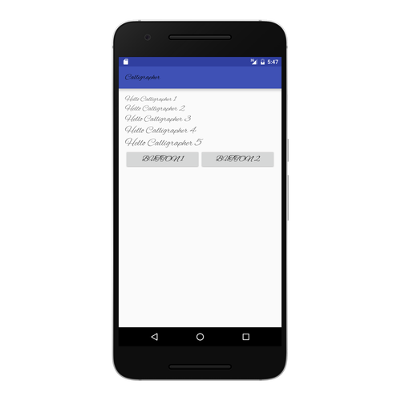

> A helper library to set custom fonts to your android view
### Please visit the website to know the [how to](http://anwarshahriar.github.io/projects/calligrapher/calligrapher.html).
> Website: http://anwarshahriar.github.io/projects/calligrapher/calligrapher.html

> This is a simple library for setting specific font to all of your view with a single line.
Feel free to fork it or fix any issues and make a pull request.

### Add to gradle dependencies
```groovy
dependencies {
  compile 'me.anwarshahriar:calligrapher:1.0'
}
```


